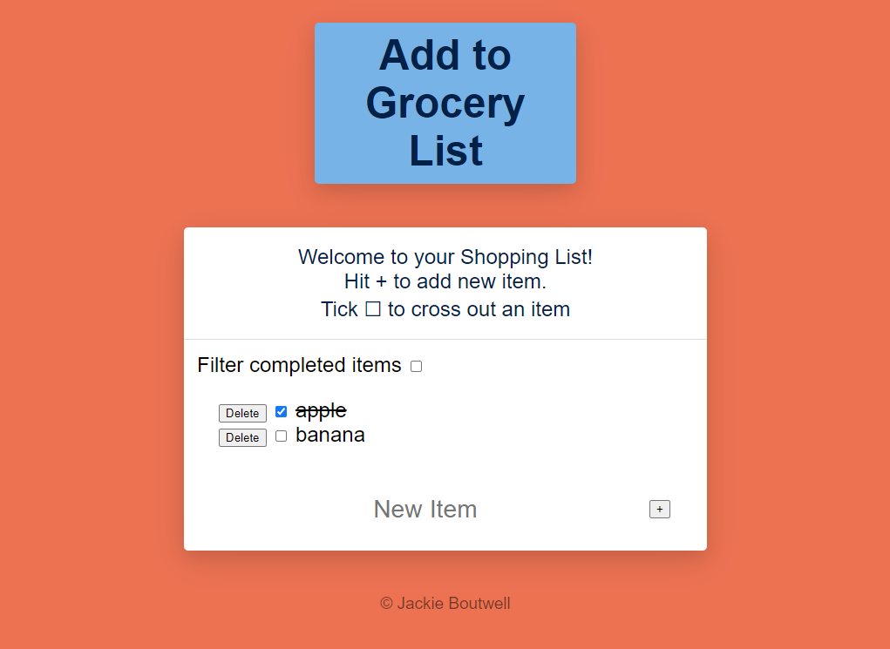

# SBA318

Skill based assessment for the Express Server Application

## Table of Contents

- [About](#about)
- [Technologies](#technologies)
- [Future app possibilities](#future-app-possibilities)
- [Screenshots](#screenshots)
- [Site link](#site-link)

## About

Tha website is the task from Perscolas Software Engineering Bootcamp.
 
The requirements were to create a small Node and Express server application. 
 The app has a single page, user can log shopping list items for up coming trips to the store.
 The user can add, complete, delete, and filter the items on the list.

 I was using simple HTML and CSS files.
 Views folder which contains ejs files.
 Data folder contains two items of data to start and a variable of filtered. \

1. Create app to practice GET, POST, PUT, PATCH, and DELETE requests.
2. Create and use at least two pieces of custom middleware.
3. Include a form within a rendered view that allows for interaction with your RESTful API.

## Technologies

- HTML
- CSS
- JavaScript
- Nodes JS
- Express JS

## Future app possibilities

There are possibilities to expand app for more features like:

1. Change single-page webiste to be more complex, many-sites.
2. Make it so that it can be resized to a mobile devices.
3. Make it so the image of todolist works.
4. In footer get linkedin and my github to be functional with icons.

## Screenshots

1. Home page:
    
   

## Site link

https://jackieboutwell.github.io/SBA318/